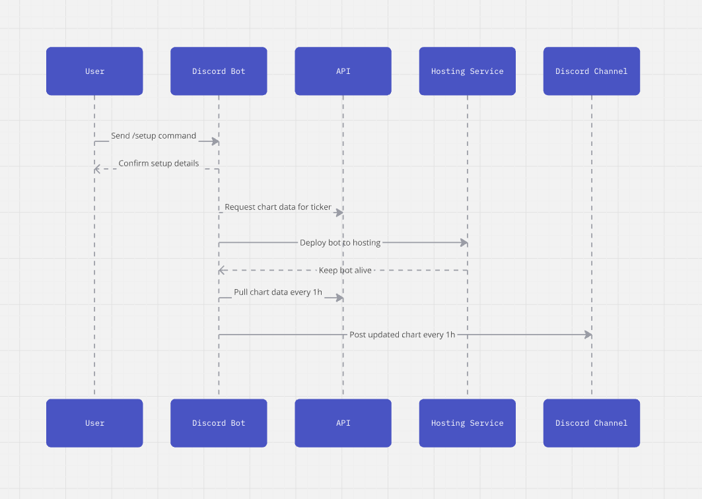

# Wizo Stock

**Wizo Stock** is a Discord bot that fetches and displays real-time stock market charts.

### **Get Started:**
After you run the bot - use the command below for setup:

> /setup <<ticker>ticker> <<interval>interval> <<channel>channel>

- "ticker": The stock symbol (e.g., ES, NQ, TSLA) [click here](https://www.tradingview.com/markets/stocks-usa/market-movers-all-stocks/) to find stock tickers.
- "interval": The update frequency (e.g., 30min, 1h, 2h, etc.).

### **Features:**
- **📈 Customizable Channels:** Choose a specific Discord channel for the bot to send stock market charts.
- **⏱️ Automated Updates:** Set intervals to receive charts automatically, ensuring you never miss a market update.

### **Important Notes**:
- **🛠️ Single Guild Support:** Currently, the bot supports only one guild (server) at a time. Support for multiple guilds may be added in the future.
- **💻 Self-Hosting Required:** You’ll need to set up your own host to run the bot.
- **🚨 DISCORD_TOKEN:** You'll need to create a .env file in the root directory and define variable DISCORD_TOKEN with your bot’s token.
- **🚨 STOCK_API:** -----

### **Current Simple Architecture**:

